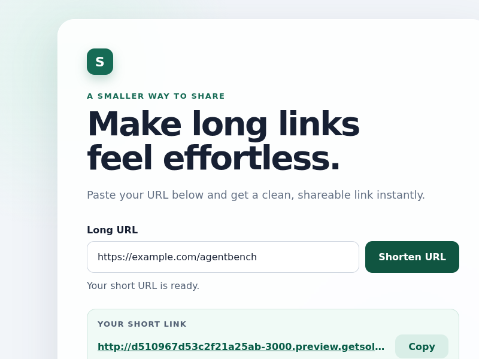
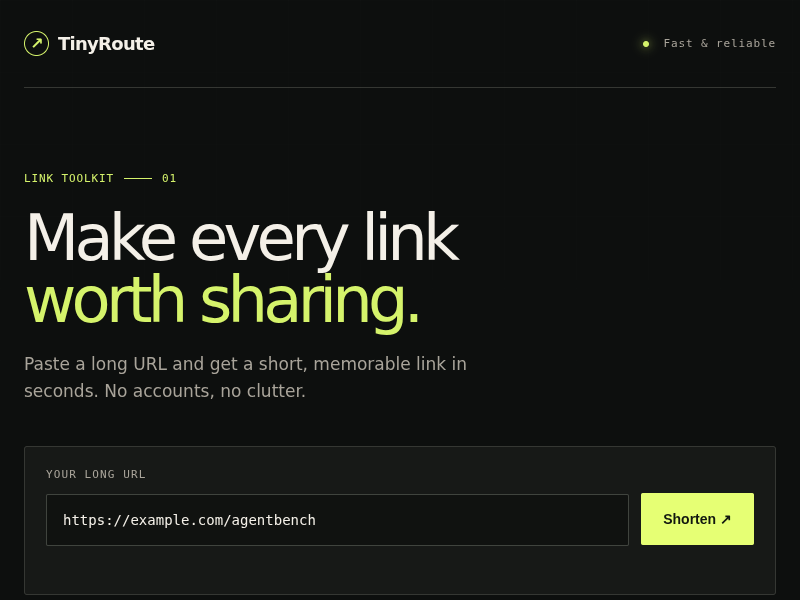
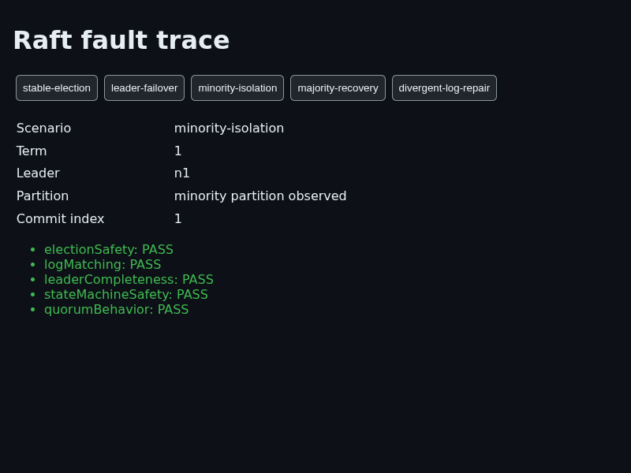

# Inspect a real comparison

The original `results.json` is a reviewed excerpt of five **historical live runs**, not synthetic demo
data and not a new benchmark run. The first four form one same-snapshot tutorial
comparison; the fifth records the unsuccessful Raft attempt. No account or local
server is needed to inspect these files.

## 1. Compare independently evaluated results

| Task | Configuration | Elapsed | Quality / 100 | Time-adjusted / 100 |
| --- | --- | --- | --- | --- |
| URL Shortener | Sol · Low | 342,158 ms | 73.33 | 64.29 |
| URL Shortener | Luna · High | 415,976 ms | 73.33 | 52.89 |
| Statistics | Sol · Low | 147,598 ms | 100 | 100 |
| Statistics | Luna · High | 337,278 ms | 100 | 88.95 |

[Open the machine-readable evidence excerpt](results.json) for run IDs, task
snapshot digests, timestamps, evaluator points, assertion outcomes, numeric
observations, input-integrity reports and artifact hashes. The timing policy is
a five-minute target and 15-minute cap. These single observations compare model
**and reasoning configurations**, not model identity alone.

## 2. See the failure the browser caught

Both URL submissions passed source, results, methodology and fresh-sandbox serve
checks. Both passed only one of three browser assertions: the generated link
failed the same-origin check, and the final URL was not the requested destination.
The browser evaluator therefore earned 13.33 of its possible 40 points.

### Sol submission, captured by the Solari verifier browser

The visible short link starts with `http://` while the preview was served over
HTTPS. The same-origin guard did not follow it. This is evidence of an actual
deployment failure, despite successful agent-reported local checks.

### Luna submission, captured by the Solari verifier browser

This viewport does not show the generated link; use the recorded assertion
outcomes rather than inferring a cause from the screenshot. Each run's two
screenshot references have the same digest because navigation was blocked.
Neither image is evidence of a successful redirect.

Both screenshots are original, unmodified PNGs from the local evidence store,
visually reviewed before export. Their byte lengths and SHA-256 digests match
the source manifests in `results.json`.

## 3. Inspect the sandbox checks and recording metadata

For Statistics, all ten evaluators passed for both configurations, including
independent reproduction and numeric checks. The integrity reports found all
16 expected input files unchanged. Empty stdout/stderr artifacts are genuine
zero-byte outputs, not a missing video. This task did not capture a plot.

Each URL recording retained 21 replay events. The JSON excerpt includes event
types and relative timestamps; DOM and other payloads are deliberately omitted.
The full replay source hashes identify the private originals. This excerpt is
not a playable recording, and hashes alone are not independent certification.

## 4. Raft: new success and preserved history

On September 6, Raft v1.2.0 passed all configured checks in both a
[fresh agent run](raft-agent-v1.2.0.json) and a separate
[live reference certification](raft-reference-v1.2.0.json). The agent earned
**100 quality / 39.21 time-adjusted** in **765,093 ms (12m 45s)**. Both workflows
passed five evaluators, including 41 command/integrity assertions and eight
browser assertions, retained 20 replay events, and reported zero cleanup issues.

The original reference PNG is shown above. The agent run independently produced
the exact same screenshot bytes (matching SHA-256), because the normalized viewer
showed the same final state. Replay hashes differ. This screenshot is not a view
of the agent writing code or a full simulation video.

The explicit task contract changed the pack snapshot to v1.2.0; the verifier was
not weakened. These checks cover five pinned scenarios and submitted traces,
not exhaustive correctness of the complete Raft protocol.

**Preserved historical failure:** v1.1.0 run `7e5cda2b-544d-4fb6-8765-40e67c466f30` earned
10 quality / 5.06 time-adjusted from static checks. Its results schema failed,
so reproduction and browser verification were skipped. No Raft capture artifacts
were produced. It is excluded from the two-configuration comparison.

## A 90-second walkthrough to record

1. Show the comparison table: same task snapshot, separate quality and time.
2. Open the Sol screenshot and point to the HTTP short link.
3. Open `results.json`: show `serve` passed and `browser` failed, then the three
   assertion outcomes. Explain that the verifier, not the agent, decides.
4. Show a Statistics run: all ten checks passed and inputs stayed unchanged.
5. Close with the current-state guide: customizable packs, optional Solari
   resources, bounded Raft verification, and no claimed outside adoption yet.

Label that video **a walkthrough of recorded results**, not a freshly running
benchmark. To film the actual local dashboard, use the
[review walkthrough](../../REVIEW-WALKTHROUGH.md). Do not open credentials or raw
database records on camera. No additional paid run is required for this excerpt.
